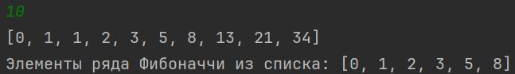
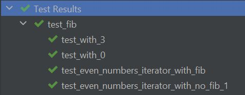

# Лабораторная работа №4

После запуска можно ввести любое число, и будет выведено столько же членов ряда Фибоначчи.
После этого будет выведен отсортированный список.

На вход для сортировки входит следующий:

```python
lst = [0, 1, 2, 3, 4, 5, 6, 7, 8, 9, 10]
fib_iterator = EvenNumbersIterator(lst) 
```


Результат работы:



Тесты на Pytest:


